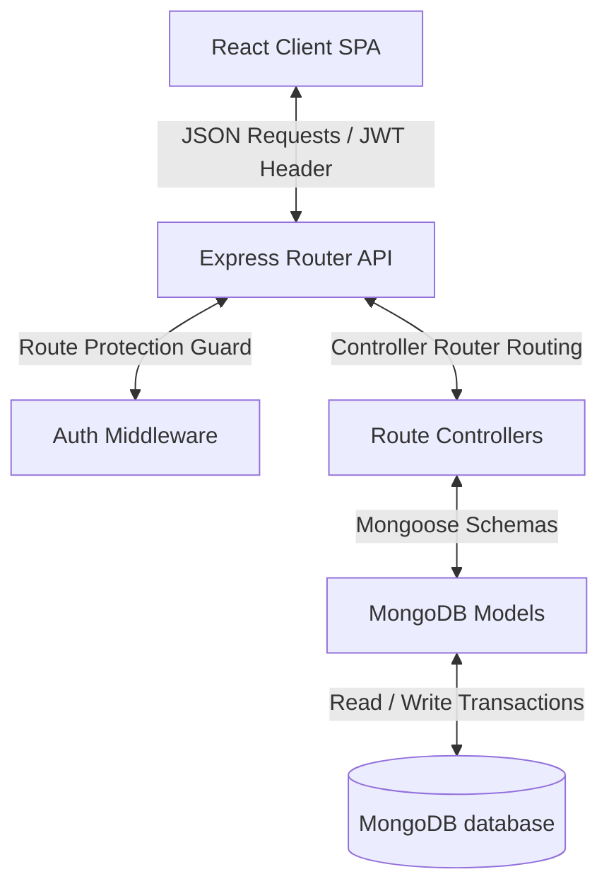

# 🩺 KineticAge – Senior Wellness Session & Subscription Management System


> **KineticAge** is a professional MERN-based healthcare administration platform designed to simplify client intake, subscription billing, therapy session tracking, payments ledgers, and reporting metrics for senior wellness and rehabilitation clinics.

---

## 📋 Table of Contents
1. [Project Overview](#-project-overview)
2. [Real-World Workflow Scenario](#-real-world-workflow-scenario)
3. [Key Features](#-key-features)
4. [Tech Stack](#-tech-stack)
5. [System Architecture](#-system-architecture)
6. [Project Structure](#-project-structure)
7. [Database Design](#-database-design)
8. [Application Flow](#-application-flow)
9. [Module Breakdowns](#-module-breakdowns)
10. [API Documentation](#-api-documentation)
11. [Data Validation](#-data-validation)
12. [Security Architecture](#-security-architecture)
13. [Installation & Setup](#-installation--setup)
14. [Environment Variables](#-environment-variables)
15. [UI Screenshots](#-ui-screenshots)
16. [Future Enhancements](#-future-enhancements)
17. [Learning Outcomes](#-learning-outcomes)
18. [License](#-license)

---

## 🔍 Project Overview

Managing care pathways, billing schedules, and rehabilitation sessions in senior wellness facilities involves coordinating medical paperwork, session logs, and invoices. Traditional administrative workflows are often disjointed, leading to missed sessions, billing mismatches, and gaps in client tracking.

**KineticAge** addresses this by providing a unified administrative cockpit tailored for geriatric care, rehabilitation clinics, and senior centers. The platform connects client intake details directly to active subscription contracts, session attendance logs, and payment transactions, allowing staff to manage everything from a single system.

### Why It's Needed
- **Cohesive Patient Journeys**: Combines medical/demographic client profiles with therapy session logs.
- **Contract-to-Payment Accountability**: Reduces billing friction by linking active client subscriptions directly to installment payments.
- **Accurate Progress Tracking**: Helps therapists record and view clinical session notes, monitoring client recovery pathways over time.

---

## 📖 Real-World Workflow Scenario

Here is how KineticAge coordinates client care and center administration in practice:

```text
[ Senior Citizen Joins ]
          │
          ▼
[ Client Registration ] ──► (Age, medical status, contact validation)
          │
          ▼
[ Membership Assign ]   ──► (1, 3, 6, 12 Month or Custom plan selection)
          │
          ▼
[ Scheduling Sessions ] ──► (Therapist assigned, program category chosen)
          │
          ▼
[ Attendance Logging ]  ──► (Present, Absent, Late or Excused; updates stats)
          │
          ▼
[ Payments Tracking ]   ──► (Invoice generated, balance tracking, receipt prints)
          │
          ▼
[ Analytics Reporting ] ──► (Real-time charts, CSV & PDF export)
```

---

## 🌟 Key Features

*   **Secure Authentication**: JWT-based user register/login flow with password hashing.
*   **Intake Client Registry**: Validated registration detailing age, gender, and contact info.
*   **Membership Subscriptions**: Plan durations (1, 3, 6, 12 Months, Custom), balance tracking, and automatic expiration checking.
*   **Daily Session Log Manager**: Therapist scheduling, program selector, and attendance tracking (Present, Absent, Late, Excused) that automatically updates client balances.
*   **Medical Progress Notes**: 500-character clinical notes logs recorded by therapists.
*   **Payments Ledger**: Sequential invoice generator (`INV-YYYY-XXXX`), partial payments tracker, and printable receipts.
*   **Real-time Reports**: Center-wide analytics covering revenue, cohort demographics, and session completion rates, with CSV and PDF export.
*   **Adaptive Styling**: ThemeProvider supporting instant Light and Dark mode transitions.
*   **Tactile Interactions**: Dynamic button press scale triggers and spring-physics modal entry animations.

---

## 💻 Tech Stack

| Layer | Technologies | Key Role |
| :--- | :--- | :--- |
| **Frontend** | React 18, Vite | Component architecture & fast hot-reloading client |
| **Backend** | Node.js, Express | RESTful routing & middleware management |
| **Database** | MongoDB Atlas, Mongoose | Schema definitions, collections, and query aggregations |
| **Authentication** | JWT, BcryptJS | Signed session handling & secure password encryption |
| **Styling** | Vanilla CSS, Lucide Icons | Responsive UI styling, variable-based theme transitions |
| **Routing** | React Router DOM v6 | Protected page routers & redirects |

---

## 🏗️ System Architecture

The following diagram illustrates the flow of data through KineticAge:



---

## 📂 Project Structure

```text
session_subs_mgt/
├── backend/                   # Node/Express API Server
│   ├── src/
│   │   ├── config/            # DB configuration & database seeders
│   │   ├── controllers/       # Business logic route controllers
│   │   ├── middleware/        # JWT auth protection & error handlers
│   │   ├── models/            # Mongoose MongoDB schemas
│   │   └── routes/            # REST API endpoint route mappings
│   ├── package.json
│   └── server.js              # Entry server listener
│
├── frontend/                  # React Single Page App
│   ├── src/
│   │   ├── components/        # Layout, Navbar, Sidebar wrappers
│   │   ├── context/           # Auth and Theme CSS context providers
│   │   ├── hooks/             # Custom useAuth and useTheme hook bindings
│   │   ├── pages/             # Dashboard, Clients, Subscriptions, etc.
│   │   ├── services/          # Axios API endpoints query wrappers
│   │   ├── routes/            # Protected/Public React routing paths
│   │   └── App.jsx            # Routing config & main client provider
│   ├── package.json
│   └── vite.config.js
```

---

## 🗄️ Database Design

KineticAge stores records in 5 Mongoose collections:

### 1. `users`
Stores administrator profiles for authentication.
*   `name` (String): Full name of the administrator.
*   `email` (String): Unique username email.
*   `password` (String): Encrypted bcrypt password.

### 2. `clients`
Intake profiles representing senior wellness participants.
*   `fullName` (String): Client's name.
*   `age` (Number): Must be between 55 and 120.
*   `gender` (String): Male, Female, or Other.
*   `email` (String): Unique client contact email.
*   `phone` (String): Contact phone number.
*   `status` (String): Active or Inactive.
*   `subscriptionStatus` (String): Active, Expired, or None.

### 3. `subscriptions`
Membership plans and billing parameters.
*   `clientId` (ObjectId): Reference to `Client`.
*   `planName` (String): Name of assigned package.
*   `price` (Number): Price of subscription.
*   `durationMonths` (Number): Package duration.
*   `totalSessions` (Number): Maximum sessions allowed.
*   `completedSessions` (Number): Conducted sessions count.
*   `remainingSessions` (Number): Outstanding sessions count.
*   `startDate` (Date): Membership start date.
*   `endDate` (Date): Membership expiration date.
*   `status` (String): Active, Expired, Expiring Soon, Cancelled, Completed.
*   `paymentStatus` (String): Paid, Partially Paid, Unpaid.
*   `remainingBalance` (Number): Outstanding unpaid balance.
*   `renewalHistory` (Array): Log of previous renewals.

### 4. `sessions`
Daily physical training and therapy session logs.
*   `clientId` (ObjectId): Reference to `Client`.
*   `therapistName` (String): Assigned therapist.
*   `programType` (String): Program category.
*   `sessionDate` (Date): Scheduled date.
*   `startTime` / `endTime` (String): Timing window.
*   `duration` (Number): Duration in minutes.
*   `attendance` (String): Present, Absent, Late, Excused.
*   `status` (String): Scheduled, Completed, Missed, Cancelled, Rescheduled.
*   `notes` (String): Therapist progress notes (max 500 characters).

### 5. `payments`
Transactions ledger tracking subscription payments.
*   `clientId` (ObjectId): Reference to `Client`.
*   `subscriptionId` (ObjectId): Reference to `Subscription`.
*   `invoiceNumber` (String): Unique identifier (`INV-YYYY-XXXX`).
*   `totalAmount` (Number): Price of membership.
*   `amountPaid` (Number): Paid transaction amount.
*   `remainingBalance` (Number): Outstanding balance.
*   `paymentMethod` (String): Cash, Card, Bank Transfer, etc.
*   `paymentStatus` (String): Paid, Partially Paid, Refunded.
*   `paymentDate` (Date): Processed timestamp.

---

## 🛠️ Module Breakdowns

### 👤 Clients
*   **Purpose**: Manages intake data and contact profiles.
*   **Real-World Usage**: Allows administrators to input age, gender, contact info, and medical status. Filters let staff identify active or inactive clients.

### 💳 Subscriptions
*   **Purpose**: Manages billing plans and membership statuses.
*   **Real-World Usage**: Automatically calculates remaining contract balances and membership expirations. Supports plan renewals and cancellations.

### 🏃‍♂️ Sessions
*   **Purpose**: Tracks daily therapy schedules and patient progress.
*   **Real-World Usage**: Enables therapists to log attendance (Present, Absent, Late, Excused) and write clinical progress notes (max 500 characters). Completed sessions are automatically logged against the client's active subscription.

### 💰 Payments
*   **Purpose**: Tracks payments and outstanding balances.
*   **Real-World Usage**: Automatically generates invoice numbers and receipt logs. Recording a payment automatically updates the client's remaining subscription balance and status.

### 📊 Reports
*   **Purpose**: Provides center-wide business and clinical analytics.
*   **Real-World Usage**: Displays metrics for revenue, cohort demographics, and session completion rates. Supports CSV and PDF exports for administrative reviews.

---

## 🌐 API Documentation

### Authentication
*   `POST /api/auth/register` - Registers a new admin user.
*   `POST /api/auth/login` - Authenticates admin and returns a JWT token.
*   `POST /api/auth/forgot-password` - Resets user password with email and new password.
*   `GET /api/auth/me` - Returns details for the authenticated user.
*   `GET /api/auth/google` - Redirects to the Google OAuth authentication screen.
*   `GET /api/auth/google/callback` - Callback endpoint that parses authentication code, upserts user profile, and redirects to client.

### Clients
*   `GET /api/clients` - Retrieves all clients (supports status filters).
*   `POST /api/clients` - Registers a new client profile.
*   `PUT /api/clients/:id` - Updates a client's details.
*   `DELETE /api/clients/:id` - Deletes a client's records.
*   `GET /api/clients/stats` - Returns dashboard statistics.

### Subscriptions
*   `GET /api/subscriptions` - Retrieves subscriptions (supports filters and sorting).
*   `POST /api/subscriptions` - Assigns a membership plan to a client.
*   `PUT /api/subscriptions/:id` - Updates subscription parameters.
*   `POST /api/subscriptions/:id/renew` - Renews a subscription and extends the end date.
*   `POST /api/subscriptions/:id/cancel` - Cancels a subscription.
*   `DELETE /api/subscriptions/:id` - Deletes a subscription record.

### Sessions
*   `GET /api/sessions` - Retrieves sessions (supports status and program filters).
*   `POST /api/sessions` - Schedules/logs a new training session.
*   `GET /api/sessions/:id` - Returns details and history for a session.
*   `PUT /api/sessions/:id` - Updates a session's details (notes, attendance, status).
*   `DELETE /api/sessions/:id` - Deletes a session record.

### Payments
*   `GET /api/payments` - Retrieves transaction histories.
*   `POST /api/payments` - Records a payment and updates the subscription.
*   `PUT /api/payments/:id` - Updates payment status.
*   `DELETE /api/payments/:id` - Deletes a payment record.

### Reports
*   `GET /api/reports/business` - Compiles center-wide reports.

---

## 🔒 Security Architecture

1.  **JWT Authentication**: API endpoints (except login/register) require a signed JWT token in the `Authorization: Bearer <TOKEN>` header.
2.  **Password Hashing**: User passwords are encrypted using `bcryptjs` with a salt factor of 10.
3.  **Protected Routes**: The React client uses `<ProtectedRoute>` wrappers to redirect unauthenticated users to `/login`.
4.  **Backend Input Validation**: Express controllers validate inputs before executing database queries (e.g., checking that email formats are valid, ages are within bounds, and durations are positive numbers).

---

## ⚙️ Data Validation

| Field | Location | Validation Rule |
| :--- | :--- | :--- |
| **Client Name** | Both | Required, 3-60 characters, alphabetic characters and spaces only. |
| **Client Age** | Both | Required, integer between 55 and 120. |
| **Client Email** | Both | Required, valid email format, unique. |
| **Client Phone** | Both | Required, 10-digit number. |
| **Subscription Price** | Both | Required, positive number. |
| **Subscription Duration** | Both | Required, positive integer. |
| **Session Times** | Both | Required, `endTime` must be later than `startTime`. |
| **Therapist Notes** | Both | Maximum 500 characters. |

---

## 🚀 Installation & Setup

### Prerequisites
- Node.js (v18 or higher)
- MongoDB running locally, or a MongoDB Atlas connection URI

### Step-by-Step Installation

1.  **Clone the Repository**:
    ```bash
    git clone https://github.com/your-username/kineticage.git
    cd kineticage
    ```

2.  **Install Dependencies**:
    Install all required dependencies for the root, backend, and frontend directories:
    ```bash
    npm run install:all
    ```

3.  **Configure Environment Variables**:
    Create a `.env` file in the `backend/` directory:
    ```env
    PORT=5001
    MONGO_URI=mongodb://localhost:27017/kineticage
    JWT_SECRET=your_jwt_signing_secret_phrase
    CLIENT_URL=http://localhost:5173
    NODE_ENV=development
    ```

4.  **Seed the Database**:
    The backend automatically seeds the database with sample senior wellness records (clients, subscriptions, payments, and sessions) on startup if the collections are empty.

5.  **Run the Applications**:
    Start the backend server and the frontend client concurrently from the root directory:
    ```bash
    npm run dev
    ```

*   **API Server**: `http://localhost:5001/api`
*   **Web Client**: `http://localhost:5174` (or port listed in the terminal)

---

## 📸 UI Screenshots

> *Note: Placeholders for visual reference*

*   **Landing Page**: A clean introduction to the wellness portal.
*   **Dashboard**: Shows cards for active memberships, upcoming sessions, and total collected revenue.
*   **Clients Registry**: A table of intake profiles, filtering by active/inactive status.
*   **Subscriptions Manager**: Displays active memberships, session trackers, and renewal actions.
*   **Sessions Scheduler**: Tracks daily logs and therapist notes.
*   **Payments Ledger**: Displays transaction details, invoice states, and receipt generation.
*   **Reports Hub**: Displays analytics charts and CSV/PDF export options.

---

## 🔮 Future Enhancements

*   **Online Appointment Scheduler**: Self-service portals for family members to request times.
*   **Automated Email/SMS Notifications**: Reminders for upcoming sessions and pending balance alerts.
*   **Role-Based Access Control (RBAC)**: Distinct permissions for Therapists, Billing Admins, and Clinic Managers.
*   **AI-Based Health Insights**: Tracks recovery metrics to highlight mobility improvements over time.

---

## 🎓 Learning Outcomes

-   **MERN Stack Development**: Built a complete, responsive single-page application using React, Node.js, and MongoDB.
-   **Database Synchronization**: Managed cascading updates across related MongoDB collections (e.g., updating subscription balances when a payment is logged).
-   **API Design**: Implemented RESTful endpoints with input validation and JWT authorization guards.
-   **Responsive CSS Design**: Created custom variable-based dark and light themes with smooth transitions.

## 🔐 Authentication & Role-Based Access

KineticAge follows a **Role-Based Access Control (RBAC)** architecture to ensure secure and organized access to system resources.

### 👤 User Portal

The public version of this project is intended to demonstrate the **User Portal**, where registered members can:

- Register a new account
- Securely log in using JWT Authentication
- Sign in using Google Authentication (if configured)
- Request wellness/training sessions
- View personal session history
- View subscription details
- Track payment history
- Manage personal profile
- Experience a responsive Light/Dark theme interface

Users can access **only their own data** and are restricted from viewing or modifying information belonging to other users.

---

### 🛠️ Admin Portal

The application also includes a dedicated **Admin Portal** for Wellness Center staff.

Admin responsibilities include:

- Managing registered clients
- Reviewing and approving session requests
- Managing subscriptions
- Managing payment records
- Monitoring wellness sessions
- Viewing system reports and analytics
- Overseeing overall platform operations

For security and privacy reasons, **administrator credentials are intentionally not included in this public repository**.

---

## 🔒 Security Notice

This repository follows standard security practices:

- JWT-based Authentication
- Role-Based Authorization (RBAC)
- Protected Backend APIs
- Environment variables excluded from GitHub
- Administrative access restricted
- Secure route protection using middleware

---

## 📝 Evaluation Note

This repository is intended to showcase the application's architecture, implementation, and user experience.

The **User Portal** is fully accessible for demonstration purposes.

The **Admin Portal** exists within the application but its credentials are intentionally withheld from the public repository to follow secure software development practices and to prevent unauthorized administrative access.

Recruiters and evaluators are encouraged to review the project architecture, code quality, backend implementation, API design, and user workflow through the available source code and documentation.