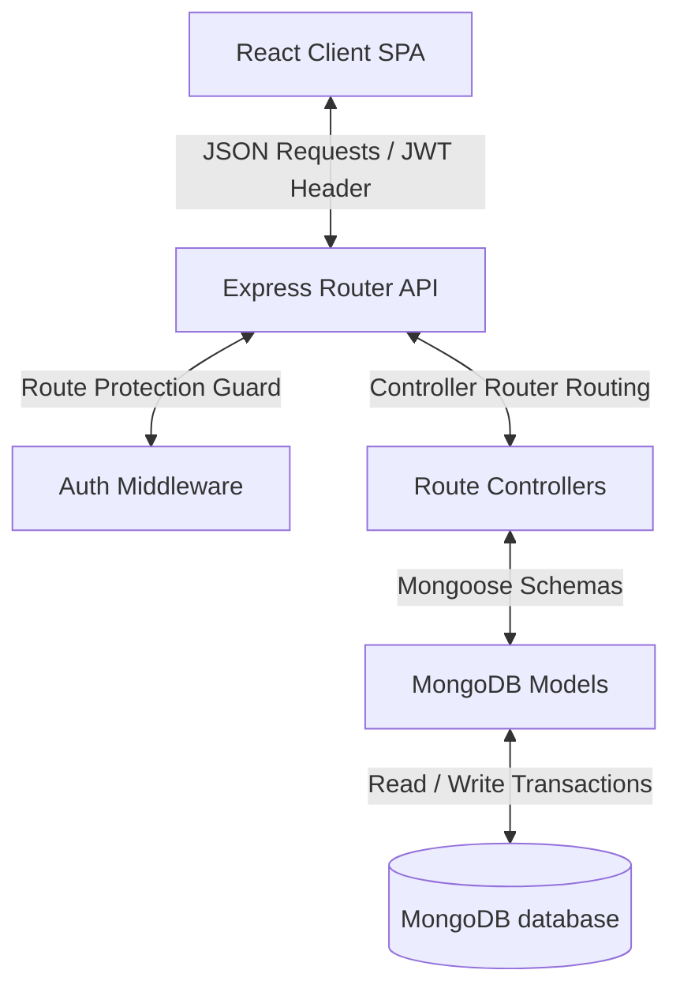
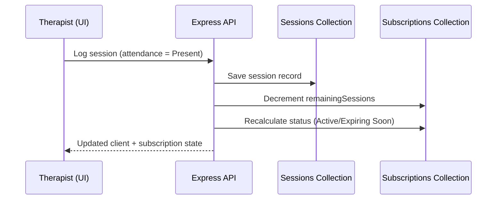

<div align="center">

# 🩺 KineticAge
### Senior Wellness Session & Subscription Management System

**A production-grade MERN platform that unifies client intake, membership billing, therapy scheduling, and clinical progress tracking for senior wellness and rehabilitation clinics — in one connected system instead of four disconnected spreadsheets.**


[Overview](#-project-overview) • [Why It's Different](#-why-kineticage-stands-out) • [Features](#-key-features) • [Architecture](#️-system-architecture) • [Setup](#-installation--setup) • [API Docs](#-api-documentation)

</div>

---

## 🔍 Project Overview

Senior wellness and rehabilitation clinics run on three things: **who's coming in, who's paying for what, and who's improving.** In most small-to-mid clinics, those three threads live in separate places — a paper intake form, a spreadsheet for billing, a notebook for session notes — and none of them talk to each other. The result is missed sessions, billing mismatches, and no real picture of a client's recovery over time.

**KineticAge** closes that gap. It's a single administrative cockpit that connects **client intake → active subscription → session attendance → payment ledger → analytics**, so that logging one event (a completed session, a payment) automatically keeps every related record in sync — no manual reconciliation required.

### Why It's Needed
- 🔗 **Cohesive Patient Journeys** — medical/demographic client profiles are linked directly to therapy session logs, not siloed in a separate system.
- 💳 **Contract-to-Payment Accountability** — active subscriptions are tied directly to installment payments, closing the loop between "what's owed" and "what's paid."
- 📈 **Accurate Progress Tracking** — therapists log clinical session notes against a persistent client history, so recovery pathways are visible over time, not scattered across paper notes.

---

## 🏆 Why KineticAge Stands Out

Most student/portfolio CRUD projects stop at "create, read, update, delete." KineticAge is built around the thing that actually makes healthcare-adjacent software hard: **cascading state consistency across related records.**

| What a typical CRUD project does | What KineticAge does |
| :--- | :--- |
| A payment form that saves a payment row | Recording a payment **recalculates** the subscription's remaining balance and payment status automatically |
| An attendance checkbox that saves an entry | Logging a session **decrements remaining sessions** and updates the client's subscription status in the same transaction |
| A generic "users" table | Two-tier **Role-Based Access Control** — a User Portal scoped to a client's own data, and an Admin Portal with center-wide visibility |
| Static dashboard numbers | **Real-time aggregation queries** for revenue, cohort demographics, and completion rates, exportable to CSV/PDF |
| One monolithic auth flow | JWT sessions **plus** Google OAuth, with bcrypt salted hashing and protected-route guards on both client and server |

This is the design detail worth pointing out to judges: **KineticAge models a real operational workflow end-to-end**, not just a set of isolated forms bolted onto a database.

---

## 🌟 Key Features

- 🔐 **Secure Authentication** — JWT-based register/login, bcrypt password hashing, and Google OAuth as an alternate sign-in path.
- 🧾 **Intake Client Registry** — validated registration capturing age, gender, and contact info, with active/inactive status filtering.
- 💳 **Membership Subscriptions** — 1/3/6/12-month or custom plans, live balance tracking, and automatic expiration detection.
- 🏃 **Daily Session Log Manager** — therapist scheduling, program-type selection, and attendance tracking (Present, Absent, Late, Excused) that automatically updates client balances.
- 📝 **Medical Progress Notes** — 500-character clinical notes per session, building a longitudinal recovery record.
- 💰 **Payments Ledger** — sequential invoice generation (`INV-YYYY-XXXX`), partial-payment tracking, and printable receipts.
- 📊 **Real-Time Reports** — center-wide analytics on revenue, cohort demographics, and session completion rates, with CSV and PDF export.
- 🎨 **Adaptive Styling** — instant Light/Dark theme transitions via a dedicated ThemeProvider.
- 🎛️ **Tactile Interactions** — press-scale button feedback and spring-physics modal entry animations for a polished, non-templated feel.
- 🛡️ **Role-Based Access Control** — separate User Portal (self-service, scoped to own data) and Admin Portal (center-wide management).

---

## 📖 Real-World Workflow Scenario

```text
[ Senior Citizen Joins ]
          │
          ▼
[ Client Registration ] ──► (Age, medical status, contact validation)
          │
          ▼
[ Membership Assign ]   ──► (1, 3, 6, 12 Month or Custom plan selection)
          │
          ▼
[ Scheduling Sessions ] ──► (Therapist assigned, program category chosen)
          │
          ▼
[ Attendance Logging ]  ──► (Present, Absent, Late or Excused; updates stats)
          │
          ▼
[ Payments Tracking ]   ──► (Invoice generated, balance tracking, receipt prints)
          │
          ▼
[ Analytics Reporting ] ──► (Real-time charts, CSV & PDF export)
```

---

## 💻 Tech Stack

| Layer | Technologies | Key Role |
| :--- | :--- | :--- |
| **Frontend** | React 18, Vite | Component architecture & fast hot-reloading client |
| **Backend** | Node.js, Express | RESTful routing & middleware management |
| **Database** | MongoDB Atlas, Mongoose | Schema definitions, collections, and query aggregations |
| **Authentication** | JWT, BcryptJS, Google OAuth | Signed session handling & secure password encryption |
| **Styling** | Vanilla CSS, Lucide Icons | Responsive UI styling, variable-based theme transitions |
| **Routing** | React Router DOM v6 | Protected page routers & redirects |

---

## 🏗️ System Architecture



### Cascading Update Flow (the part worth demoing live)



---

## 📂 Project Structure

```text
session_subs_mgt/
├── backend/                   # Node/Express API Server
│   ├── src/
│   │   ├── config/            # DB configuration & database seeders
│   │   ├── controllers/       # Business logic route controllers
│   │   ├── middleware/        # JWT auth protection & error handlers
│   │   ├── models/            # Mongoose MongoDB schemas
│   │   └── routes/            # REST API endpoint route mappings
│   ├── package.json
│   └── server.js              # Entry server listener
│
├── frontend/                  # React Single Page App
│   ├── src/
│   │   ├── components/        # Layout, Navbar, Sidebar wrappers
│   │   ├── context/           # Auth and Theme CSS context providers
│   │   ├── hooks/             # Custom useAuth and useTheme hook bindings
│   │   ├── pages/             # Dashboard, Clients, Subscriptions, etc.
│   │   ├── services/          # Axios API endpoints query wrappers
│   │   ├── routes/            # Protected/Public React routing paths
│   │   └── App.jsx            # Routing config & main client provider
│   ├── package.json
│   └── vite.config.js
```

---

## 🗄️ Database Design

KineticAge stores records in 5 Mongoose collections:

### 1. `users`
Stores administrator profiles for authentication.
- `name` (String) — Full name of the administrator.
- `email` (String) — Unique username email.
- `password` (String) — Encrypted bcrypt password.

### 2. `clients`
Intake profiles representing senior wellness participants.
- `fullName` (String) — Client's name.
- `age` (Number) — Must be between 55 and 120.
- `gender` (String) — Male, Female, or Other.
- `email` (String) — Unique client contact email.
- `phone` (String) — Contact phone number.
- `status` (String) — Active or Inactive.
- `subscriptionStatus` (String) — Active, Expired, or None.

### 3. `subscriptions`
Membership plans and billing parameters.
- `clientId` (ObjectId) — Reference to `Client`.
- `planName` (String) — Name of assigned package.
- `price` (Number) — Price of subscription.
- `durationMonths` (Number) — Package duration.
- `totalSessions` (Number) — Maximum sessions allowed.
- `completedSessions` (Number) — Conducted sessions count.
- `remainingSessions` (Number) — Outstanding sessions count.
- `startDate` / `endDate` (Date) — Membership window.
- `status` (String) — Active, Expired, Expiring Soon, Cancelled, Completed.
- `paymentStatus` (String) — Paid, Partially Paid, Unpaid.
- `remainingBalance` (Number) — Outstanding unpaid balance.
- `renewalHistory` (Array) — Log of previous renewals.

### 4. `sessions`
Daily physical training and therapy session logs.
- `clientId` (ObjectId) — Reference to `Client`.
- `therapistName` (String) — Assigned therapist.
- `programType` (String) — Program category.
- `sessionDate` (Date) — Scheduled date.
- `startTime` / `endTime` (String) — Timing window.
- `duration` (Number) — Duration in minutes.
- `attendance` (String) — Present, Absent, Late, Excused.
- `status` (String) — Scheduled, Completed, Missed, Cancelled, Rescheduled.
- `notes` (String) — Therapist progress notes (max 500 characters).

### 5. `payments`
Transactions ledger tracking subscription payments.
- `clientId` (ObjectId) — Reference to `Client`.
- `subscriptionId` (ObjectId) — Reference to `Subscription`.
- `invoiceNumber` (String) — Unique identifier (`INV-YYYY-XXXX`).
- `totalAmount` (Number) — Price of membership.
- `amountPaid` (Number) — Paid transaction amount.
- `remainingBalance` (Number) — Outstanding balance.
- `paymentMethod` (String) — Cash, Card, Bank Transfer, etc.
- `paymentStatus` (String) — Paid, Partially Paid, Refunded.
- `paymentDate` (Date) — Processed timestamp.

---

## 🛠️ Module Breakdowns

### 👤 Clients
**Purpose:** Manages intake data and contact profiles.
**Real-World Usage:** Administrators input age, gender, contact info, and medical status. Filters let staff instantly surface active or inactive clients.

### 💳 Subscriptions
**Purpose:** Manages billing plans and membership statuses.
**Real-World Usage:** Automatically calculates remaining contract balances and membership expirations. Supports plan renewals and cancellations without manual math.

### 🏃‍♂️ Sessions
**Purpose:** Tracks daily therapy schedules and patient progress.
**Real-World Usage:** Therapists log attendance and write clinical progress notes. Completed sessions are automatically counted against the client's active subscription — no separate reconciliation step.

### 💰 Payments
**Purpose:** Tracks payments and outstanding balances.
**Real-World Usage:** Auto-generates invoice numbers and receipt logs. Recording a payment immediately updates the client's remaining subscription balance and status.

### 📊 Reports
**Purpose:** Provides center-wide business and clinical analytics.
**Real-World Usage:** Surfaces revenue, cohort demographics, and session completion rates in real time, with CSV and PDF export for administrative reviews.

---

## 🌐 API Documentation

### Authentication
| Method | Endpoint | Description |
| :--- | :--- | :--- |
| POST | `/api/auth/register` | Registers a new admin user |
| POST | `/api/auth/login` | Authenticates admin and returns a JWT token |
| POST | `/api/auth/forgot-password` | Resets user password with email and new password |
| GET | `/api/auth/me` | Returns details for the authenticated user |
| GET | `/api/auth/google` | Redirects to Google OAuth authentication screen |
| GET | `/api/auth/google/callback` | Parses auth code, upserts user profile, redirects to client |

### Clients
| Method | Endpoint | Description |
| :--- | :--- | :--- |
| GET | `/api/clients` | Retrieves all clients (supports status filters) |
| POST | `/api/clients` | Registers a new client profile |
| PUT | `/api/clients/:id` | Updates a client's details |
| DELETE | `/api/clients/:id` | Deletes a client's records |
| GET | `/api/clients/stats` | Returns dashboard statistics |

### Subscriptions
| Method | Endpoint | Description |
| :--- | :--- | :--- |
| GET | `/api/subscriptions` | Retrieves subscriptions (filters + sorting) |
| POST | `/api/subscriptions` | Assigns a membership plan to a client |
| PUT | `/api/subscriptions/:id` | Updates subscription parameters |
| POST | `/api/subscriptions/:id/renew` | Renews a subscription and extends the end date |
| POST | `/api/subscriptions/:id/cancel` | Cancels a subscription |
| DELETE | `/api/subscriptions/:id` | Deletes a subscription record |

### Sessions
| Method | Endpoint | Description |
| :--- | :--- | :--- |
| GET | `/api/sessions` | Retrieves sessions (status/program filters) |
| POST | `/api/sessions` | Schedules/logs a new training session |
| GET | `/api/sessions/:id` | Returns details and history for a session |
| PUT | `/api/sessions/:id` | Updates a session's details (notes, attendance, status) |
| DELETE | `/api/sessions/:id` | Deletes a session record |

### Payments
| Method | Endpoint | Description |
| :--- | :--- | :--- |
| GET | `/api/payments` | Retrieves transaction histories |
| POST | `/api/payments` | Records a payment and updates the subscription |
| PUT | `/api/payments/:id` | Updates payment status |
| DELETE | `/api/payments/:id` | Deletes a payment record |

### Reports
| Method | Endpoint | Description |
| :--- | :--- | :--- |
| GET | `/api/reports/business` | Compiles center-wide reports |

---

## 🔒 Security Architecture

1. **JWT Authentication** — API endpoints (except login/register) require a signed JWT in the `Authorization: Bearer <TOKEN>` header.
2. **Password Hashing** — user passwords are encrypted using `bcryptjs` with a salt factor of 10.
3. **Protected Routes** — the React client uses `<ProtectedRoute>` wrappers to redirect unauthenticated users to `/login`.
4. **Backend Input Validation** — Express controllers validate inputs before executing database queries (email formats, age bounds, positive durations, etc.).
5. **Role Separation** — User Portal accounts can only read/write their own records; Admin Portal accounts operate center-wide, enforced server-side rather than trusted to the client.

---

## ⚙️ Data Validation

| Field | Location | Validation Rule |
| :--- | :--- | :--- |
| **Client Name** | Both | Required, 3–60 characters, alphabetic characters and spaces only |
| **Client Age** | Both | Required, integer between 55 and 120 |
| **Client Email** | Both | Required, valid email format, unique |
| **Client Phone** | Both | Required, 10-digit number |
| **Subscription Price** | Both | Required, positive number |
| **Subscription Duration** | Both | Required, positive integer |
| **Session Times** | Both | Required, `endTime` must be later than `startTime` |
| **Therapist Notes** | Both | Maximum 500 characters |

---

## 🚀 Installation & Setup

### Prerequisites
- Node.js (v18 or higher)
- MongoDB running locally, or a MongoDB Atlas connection URI

### Step-by-Step Installation

**1. Clone the repository**
```bash
git clone https://github.com/your-username/kineticage.git
cd kineticage
```

**2. Install dependencies** (root, backend, and frontend)
```bash
npm run install:all
```

**3. Configure environment variables** — create a `.env` file in `backend/`:
```env
PORT=5001
MONGO_URI=mongodb://localhost:27017/kineticage
JWT_SECRET=your_jwt_signing_secret_phrase
CLIENT_URL=http://localhost:5173
NODE_ENV=development
```

**4. Seed the database** — on first run with empty collections, the backend automatically seeds sample senior wellness records (clients, subscriptions, payments, sessions).

**5. Run the applications**
```bash
npm run dev
```

- **API Server:** `http://localhost:5001/api`
- **Web Client:** `http://localhost:5174` (or the port shown in the terminal)

---

## 📸 UI Screenshots

> *Add real screenshots here before submission — a judge scrolls the README before running the app. Suggested set:*

| Screen | What to Capture |
| :--- | :--- |
| Landing Page | Clean introduction to the wellness portal |
| Dashboard | Active memberships, upcoming sessions, revenue cards |
| Clients Registry | Intake table with active/inactive filtering |
| Subscriptions Manager | Active memberships, session trackers, renewal actions |
| Sessions Scheduler | Daily logs and therapist notes in context |
| Payments Ledger | Transaction details, invoice states, receipt generation |
| Reports Hub | Analytics charts and CSV/PDF export options |
| Light/Dark Mode | Side-by-side theme comparison — a small touch that reads as polish |

---

## 🔐 Authentication & Role-Based Access

KineticAge follows a **Role-Based Access Control (RBAC)** architecture to keep access secure and organized.

### 👤 User Portal
The public-facing demo surfaces the **User Portal**, where registered members can:
- Register a new account
- Log in securely via JWT (or Google OAuth, if configured)
- Request wellness/training sessions
- View personal session history
- View subscription details and payment history
- Manage their profile
- Use a responsive Light/Dark theme interface

Users can access **only their own data** — they cannot view or modify other clients' records.

### 🛠️ Admin Portal
A dedicated **Admin Portal** for wellness center staff handles:
- Managing registered clients
- Reviewing and approving session requests
- Managing subscriptions and payment records
- Monitoring wellness sessions
- Viewing system reports and analytics
- Overseeing overall platform operations

> Administrator credentials are intentionally excluded from this public repository for security. Evaluators can review the Admin Portal's architecture and code directly.

---

## 🔮 Future Enhancements

- 📅 **Online Appointment Scheduler** — self-service portal for family members to request session times.
- 🔔 **Automated Email/SMS Notifications** — reminders for upcoming sessions and pending balance alerts.
- 🧑‍⚕️ **Expanded RBAC** — distinct permissions for Therapists, Billing Admins, and Clinic Managers.
- 🤖 **AI-Based Health Insights** — surfaces mobility/recovery trends from session history over time.
- 📱 **Mobile Companion App** — quick attendance check-in and balance view for staff on the floor.

---

## 🎓 Learning Outcomes

- **MERN Stack Development** — built a complete, responsive single-page application using React, Node.js, and MongoDB.
- **Database Synchronization** — managed cascading updates across related MongoDB collections (e.g., a payment automatically updating subscription balance and status).
- **API Design** — implemented RESTful endpoints with input validation and JWT authorization guards.
- **Responsive CSS Design** — built variable-based dark and light themes with smooth transitions.

---

## 📝 Evaluation Note

This repository showcases the application's architecture, implementation, and user experience. The **User Portal** is fully accessible for demonstration purposes. The **Admin Portal** exists within the application, but its credentials are intentionally withheld from the public repository to follow secure software development practices and prevent unauthorized administrative access.

Evaluators are encouraged to review the project architecture, code quality, backend implementation, API design, and user workflow through the available source code and documentation.

---

## 📄 License

This project is licensed under the MIT License — see the `LICENSE` file for details.

<div align="center">

**Built with the goal of solving a real operational problem, not just checking CRUD boxes.**

</div>